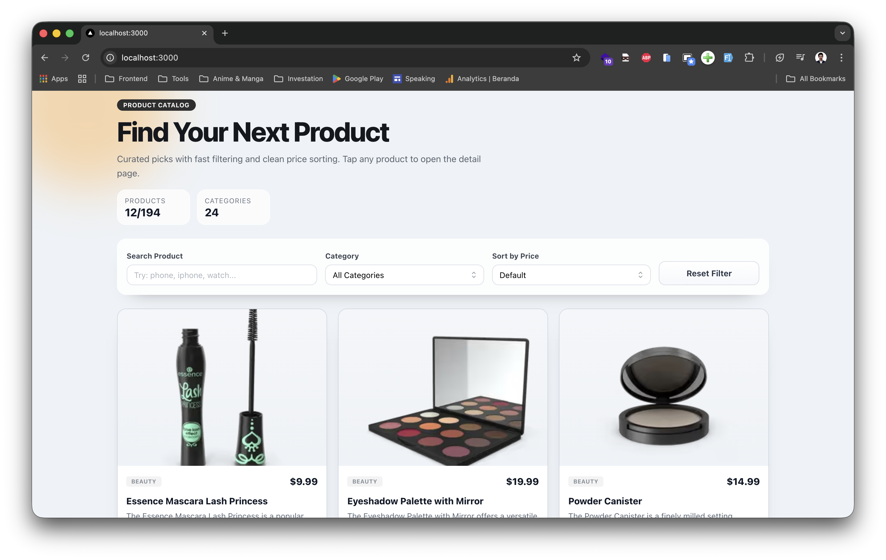
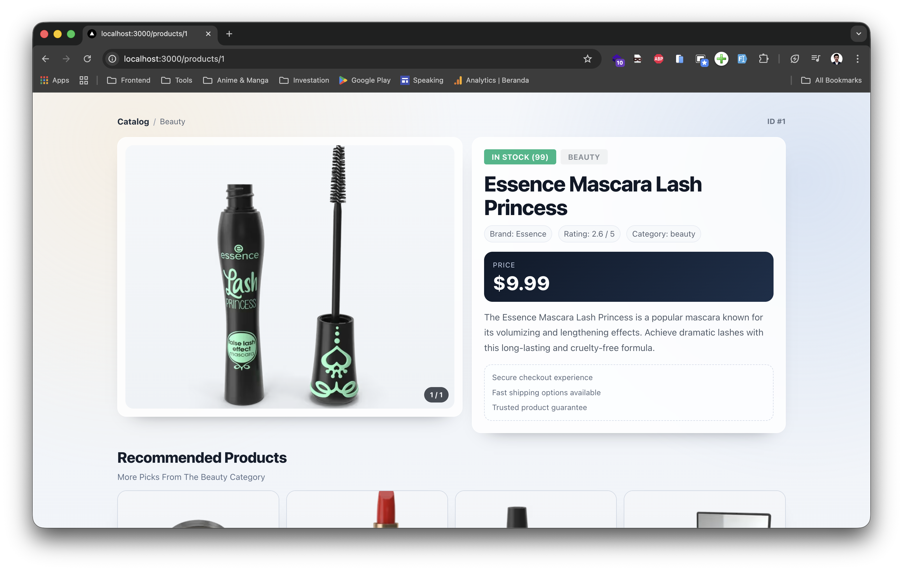
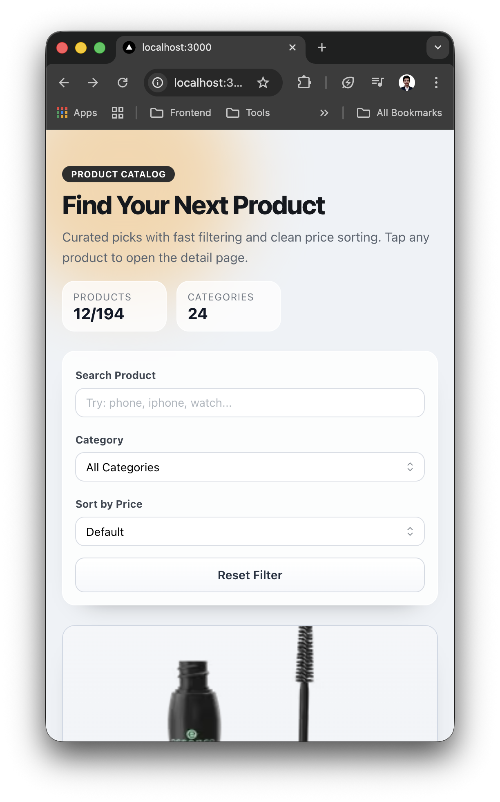
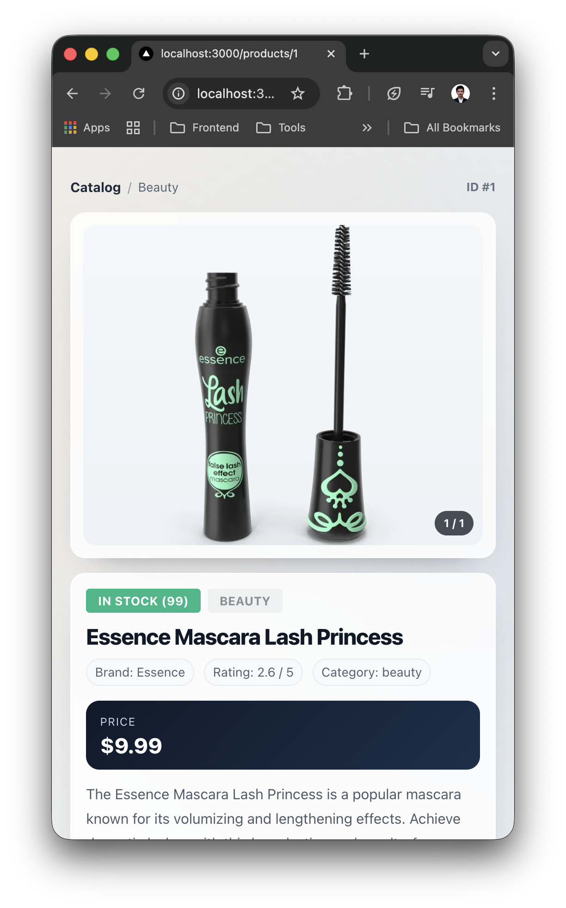
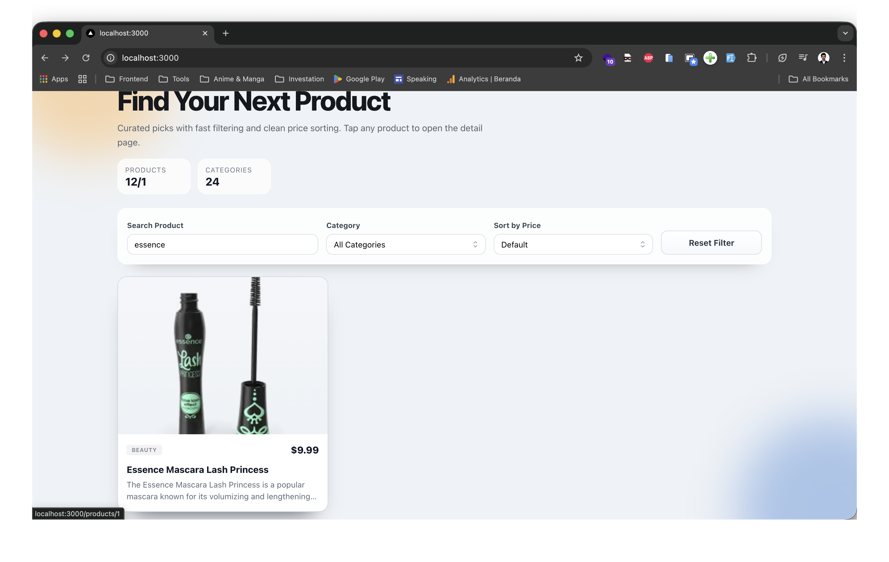
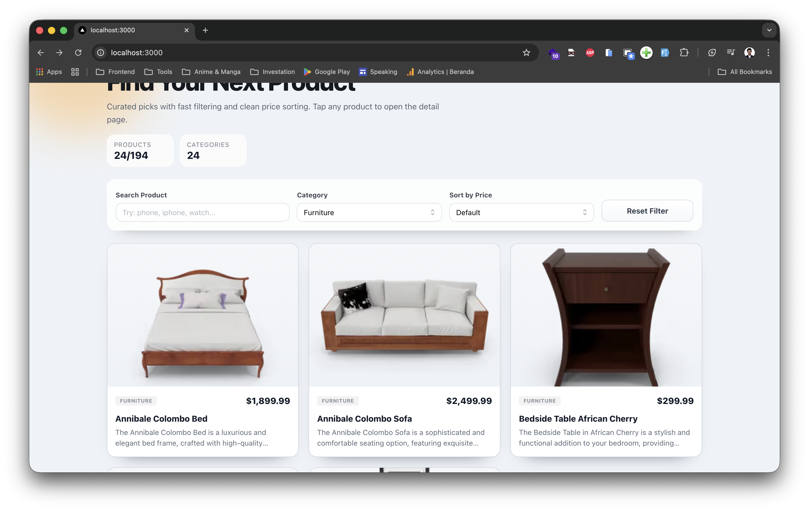
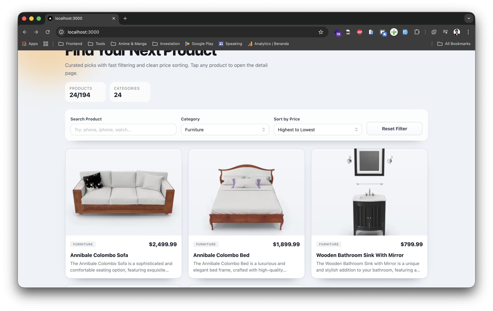
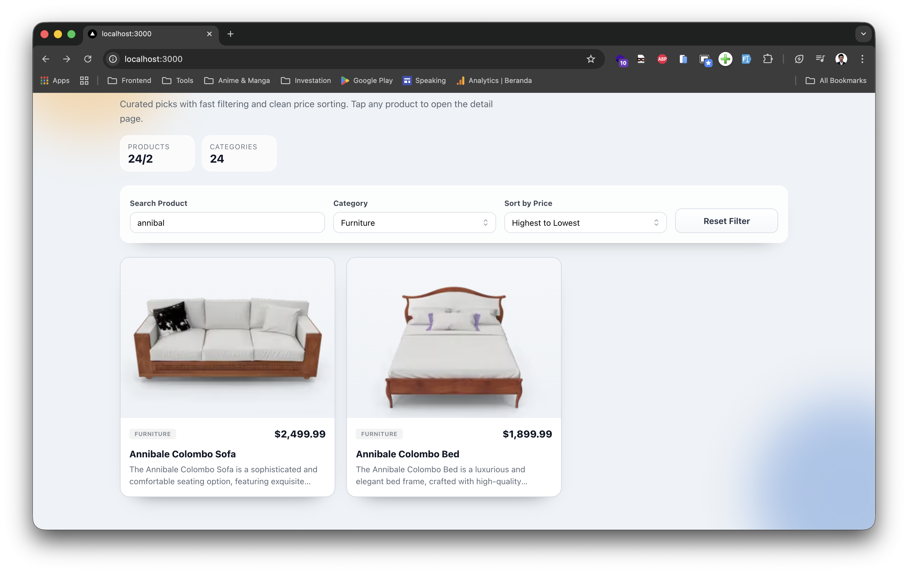

# Fabrotec - Product Page Optimisation

Next.js + TypeScript implementation untuk technical challenge frontend.

## Main Features

- Product list page (`/`)
- Product detail page (`/products/[id]`)
- Category filter + sorting + search
- Infinite scroll on product list
- Recommended products on detail page
- Custom 404 page

## Performance Optimisations

- Static Generation + ISR (`getStaticProps`, `getStaticPaths`)
- Optimized image loading with `next/image`
- Prefetching for faster page navigation
- Web Vitals reporting endpoint (`/api/vitals`)

## Run Locally

```bash
yarn install
yarn dev
```

## Evidence

1. [evidence-01.png](./public/evidence/evidence-01.png)
2. [evidence-02.png](./public/evidence/evidence-02.png)
3. [evidence-03.png](./public/evidence/evidence-03.png)
4. [evidence-04.png](./public/evidence/evidence-04.png)
5. [evidence-05.png](./public/evidence/evidence-05.png)
6. [evidence-06.png](./public/evidence/evidence-06.png)
7. [evidence-07.png](./public/evidence/evidence-07.png)
8. [evidence-08.png](./public/evidence/evidence-08.png)

### Preview









